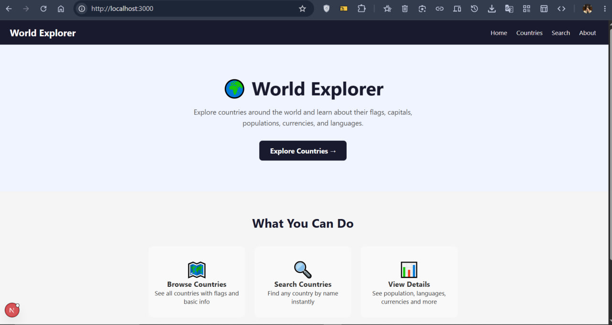
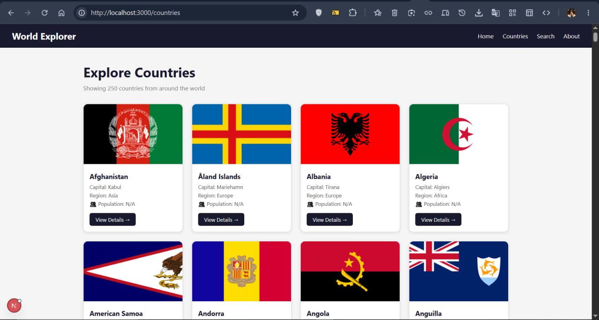
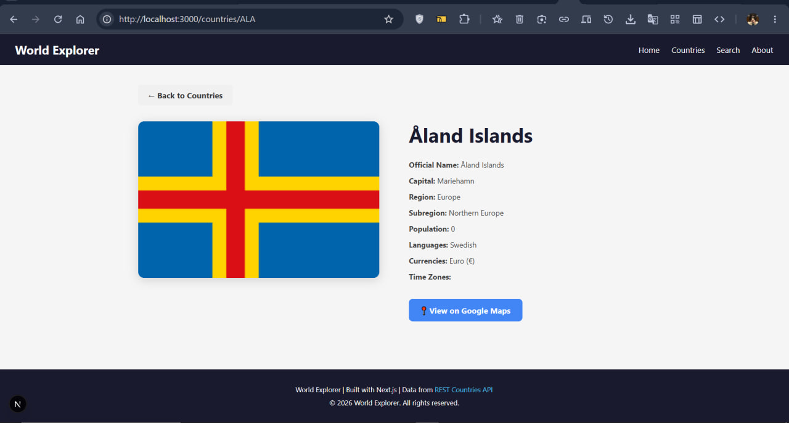
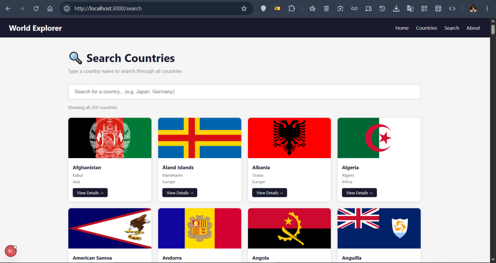

# World Explorer

World Explorer is a Next.js project that allows users to explore countries around the world.

## Features

- App Router
- File-based routing
- Shared layout
- Dynamic routes
- Server components
- Client components
- Real API data fetching
- Static rendering and caching
- Dynamic rendering
- Search functionality

## API Used

This project originally targeted the **REST Countries API** (https://restcountries.com), but the v3.1 endpoint has been **deprecated** during development.

To keep the app functional, the project now uses the same countries dataset hosted on GitHub:

- **Data Source:** https://github.com/mledoze/countries
- **Flag Images:** https://flagcdn.com

Both are free and require no API key. The data structure is the same as REST Countries.

## Pages

- `/` - Home page with hero section
- `/countries` - All countries with flags and info
- `/countries/[code]` - Detailed page for each country
- `/search` - Search countries by name
- `/about` - About the project

## Run Locally

npm install
npm run dev

## Screenshots

### Home Page

### Countries Page

### Country Details Page

### Search Page

